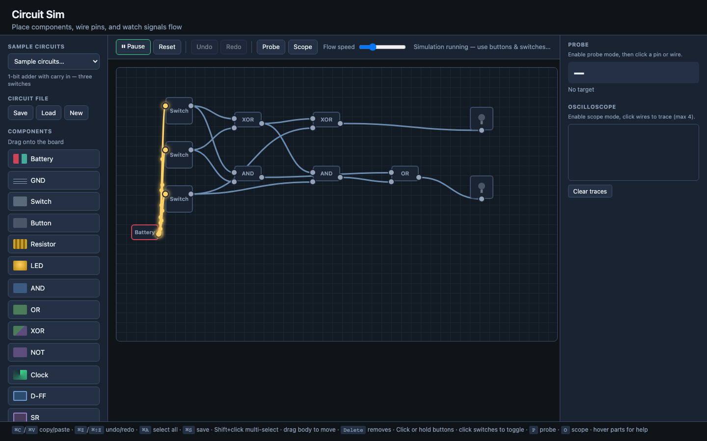

# Circuit Sim



Build electronic circuits in the browser and watch digital signals flow along wires.

## Run locally

**Single file:** open `index.html` directly in your browser (double-click or drag into a tab). All CSS and JavaScript are inlined — no server required.

Optional — if you edit the split `js/` / `css/` sources, rebundle with:

```bash
node scripts/bundle.js
```

Or serve the folder for development:

```bash
cd ~/Projects/circuit-sim
python3 -m http.server 8080
```

## Features

- **Components**: battery, switch, button, resistor, LED, AND, OR, XOR, NOT, clock, D flip-flop, SR latch
- **Wiring**: click output → input; right-click wire to delete
- **Simulation**: Run / Step / Reset; animated pulses on active wires
- **Edit**: undo/redo, multi-select (Shift+click), copy/paste, select all
- **Files**: save/load `.json` circuits; autosave to browser storage
- **Sample circuits**: dropdown with 9 ready-made examples (adders, counters, shift register, traffic light, etc.)

## Keyboard shortcuts

| Shortcut | Action |
|----------|--------|
| ⌘/Ctrl+Z | Undo |
| ⌘/Ctrl+Shift+Z | Redo |
| ⌘/Ctrl+C | Copy selection |
| ⌘/Ctrl+V | Paste |
| ⌘/Ctrl+A | Select all |
| ⌘/Ctrl+S | Save JSON + autosave |
| Delete | Remove selection |
| Space (hold) | Press buttons |

## Circuit file format

```json
{
  "version": 1,
  "savedAt": "2026-06-02T12:00:00.000Z",
  "components": [
    { "id": "c1", "type": "battery", "x": 80, "y": 200, "state": {} }
  ],
  "wires": [
    { "id": "w1", "from": { "compId": "c1", "pinId": "out" }, "to": { "compId": "c2", "pinId": "in" } }
  ]
}
```

## Sequential logic

- **D-FF**: On rising edge of `clk`, `Q` takes the value of `d`.
- **SR latch**: `S` sets Q high; `R` resets Q low (avoid S and R high together).

Connect a **Clock** output to `clk` on the D-FF and use **Step** or **Run** to advance time.

## Tech

Vanilla HTML, CSS, and JavaScript. The app ships as one self-contained `index.html` (~47 KB). Source is also split under `js/` and `css/` for easier editing; run `node scripts/bundle.js` to rebuild the single file.
